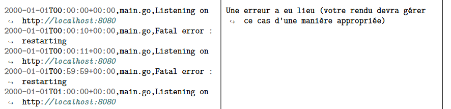

## How to launch
>copy the file "journaux.csv" to the root of the project 
    
### Locally
>make install

>make run

### With Docker
>make docker-run
    

### Testing 
> make test

## Personal notes 
> Je suis parti du principe que lors du cas d'erreur:  
> qu'il faut quand même retourner les erreurs mais de tout ceux qui ont eu le plus d'occurence et non seulement 1 seul

> Certains tests du service AnalysisLog ne semblent pas passer de manière aléatoire (lié au fait qu'il y a une différence d'ordre dans la slice quand j'assert les données). C'est à corriger mais je n'ai pas trouvé de solution viable de mon côté